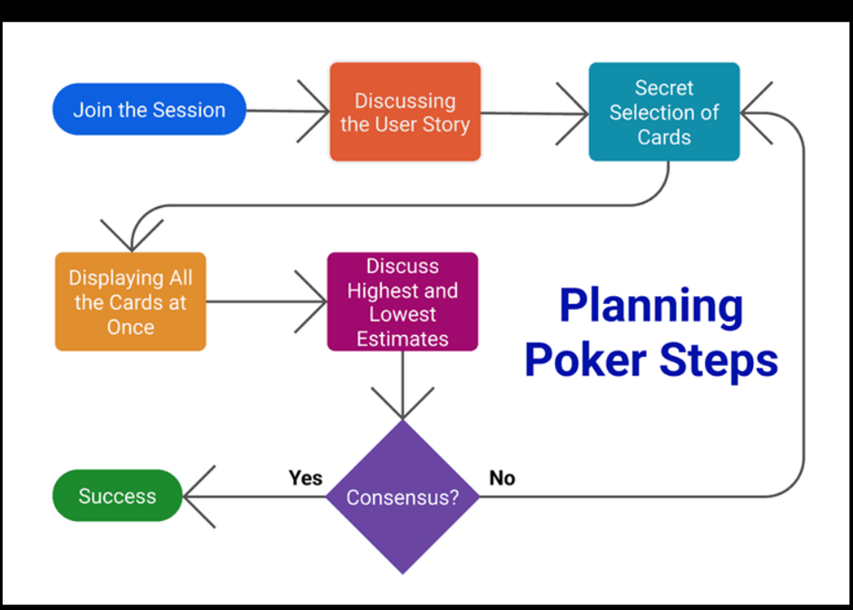

# Task Estimation in Scrum

 Task estimation in Scrum is the process of predicting the effort required to complete a user story or task within a sprint. It allows teams to plan their work effectively, ensuring that they take on a realistic amount of work and deliver consistently. 

In Scrum, estimation is done collaboratively by the entire team, rather than by individuals. Tasks are typically broken down into smaller pieces and assigned relative values, such as story points, based on factors like complexity, effort, and uncertainty. 

The purpose of estimation is not to produce exact timelines, but to create a shared understanding of the work involved. This helps teams prioritise tasks, identify potential risks, and improve the accuracy of their planning over time. 

***

### Best Practices 

* **Use relative estimation (Story Points) instead of time** 
Using relative estimation with story points allows teams to estimate tasks by comparing them to previously completed work rather than assigning exact time values. Instead of predicting how many hours a task will take, the team evaluates its complexity, effort, and uncertainty in relation to other tasks. For example, if a login feature was estimated as 3 story points, a slightly more complex feature such as password reset might be estimated as 5 story points. This approach reduces the pressure of time-based estimates and leads to more consistent and accurate planning over time, as teams rely on shared experience rather than guesswork.

 

* **Use collaborative estimation techniques**
Using collaborative estimation techniques such as Planning Poker ensures that all team members are involved in the estimation process. Instead of relying on one individual, each team member provides their own estimate, which helps to avoid bias, particularly from more senior developers. During Planning Poker, estimates are revealed simultaneously, encouraging discussion when there are differences in opinion. For example, if one developer estimates a task as 3 story points and another as 8, the team discusses the reasons behind their choices before agreeing on a final estimate. This process promotes shared understanding, improves accuracy, and ensures that all perspectives are considered.

 

* **Break Down Work Effectively**
Breaking down work into smaller, manageable user stories is essential for accurate estimation in Scrum. Large tasks are often difficult to understand fully and can lead to unrealistic or inconsistent estimates. By splitting work into smaller pieces, teams can better assess the effort required and reduce uncertainty. For example, instead of estimating a large task like “build user authentication,” the team can divide it into smaller stories such as “create login page,” “implement registration,” and “add password reset.” These smaller tasks are easier to estimate and are more likely to be completed within a single sprint, leading to more reliable planning and delivery. 

 

* **Use historical data (Velocity)**
Using historical data, such as team velocity, helps improve the accuracy of task estimation in Scrum. Velocity refers to the amount of work a team has completed in previous sprints and can be used as a guide for future planning. By analysing past performance, teams can better understand how much work they can realistically take on in a sprint. For example, if a team consistently completes around 30 story points per sprint, they should aim to plan a similar amount of work rather than overcommitting. This approach helps prevent overloading the team and leads to more predictable and sustainable delivery.

 

* **Account for uncertainty and risk**
Accounting for uncertainty and risk is an important part of effective estimation in Scrum. Not all tasks are equally predictable, especially when they involve new technologies, unclear requirements, or dependencies on external systems. In such cases, teams should assign higher estimates to reflect the added complexity and potential challenges. For example, implementing a familiar feature may be estimated as 3 story points, while integrating a new API with limited documentation might be estimated as 8. By recognising uncertainty and avoiding overly optimistic assumptions, teams can create more realistic plans and reduce the likelihood of delays.

 

* **Encourage Discussion Before Estimating**
Encouraging team discussion before assigning estimates helps ensure that everyone has a clear understanding of the task. By discussing requirements, assumptions, and potential challenges, teams can identify hidden complexity that might otherwise be overlooked. For example, a task that initially seems simple may involve additional validation or integration work that increases its complexity. Open discussion allows team members to share different perspectives and ask questions, leading to more informed and accurate estimates. This also promotes alignment within the team and reduces misunderstandings during the sprint.

***

### Common Problems in Task Estimation

There are several common bad practices in Scrum estimation that can negatively impact team performance and software quality. Estimating tasks in hours instead of using story points often creates unnecessary pressure and leads to inaccurate predictions. Relying on a single person, such as a senior developer, to decide estimates can introduce bias and reduce team collaboration. Additionally, failing to discuss tasks before estimating can result in misunderstandings and overlooked complexity. Teams may also underestimate work in an attempt to appear more productive, which can lead to missed deadlines and increased stress. Ignoring historical data, such as team velocity, makes planning less reliable, while estimating large, unbroken tasks (epics) often leads to poor accuracy. Finally, treating estimates as fixed deadlines rather than flexible guidelines can create unrealistic expectations. These practices ultimately lead to inconsistent delivery, team burnout, and reduced software quality. 

***
### Real world challanges in task estimation

In practice, task estimation in Scrum is not always accurate and can be influenced by several real-world challenges. Estimation is inherently uncertain, as it is difficult to predict exactly how long or how complex a task will be. Different developers may also have varying levels of experience, which can lead to differing opinions on how difficult a task is. Additionally, requirements can change during a sprint, making initial estimates less reliable. New teams often struggle with estimation because they lack historical data, such as velocity, to guide their planning. External pressure from stakeholders can also result in unrealistic estimates, especially when teams feel pushed to deliver work within tight deadlines. These challenges highlight the importance of continuous improvement and team collaboration in refining estimation over time.

***

### Tools used for task estimation

Several tools are commonly used to support task estimation and sprint planning in Scrum teams. Tools such as Jira and Azure DevOps allow teams to create user stories, assign story points, and track progress across sprints. Azure DevOps, for example, is widely used in industry environments to manage backlogs and monitor team velocity. Simpler tools like Trello can also be used for smaller teams to organise tasks and support basic estimation processes. These tools help improve visibility, collaboration, and consistency in estimation and project planning.

The diagram above illustrates the Scrum estimation process, where a product backlog item is discussed by the team, estimated collaboratively using techniques such as Planning Poker, and assigned story points before being included in sprint planning. Planning Poker is a consensus-based estimation technique where team members independently estimate effort and then discuss differences to reach agreement

***

#### References:

[World Of Agile - Agile Estimation With Planning Poker](https://worldofagile.com/blog/agile-estimations-with-planning-poker/)

[Mountain Goat Software - Planning Poker](https://www.mountaingoatsoftware.com/agile/planning-poker)

[The Knowledge Academy - Scrum Estimation Techniques](https://www.theknowledgeacademy.com/blog/scrum-estimation-techniques/)

[LogRocket - Planning Poker in Agile Estimation](https://blog.logrocket.com/product-management/planning-poker-agile-estimation-scrum/)

[Easy Agile - Planning Poker Guide](https://www.easyagile.com/blog/planning-poker-agile)